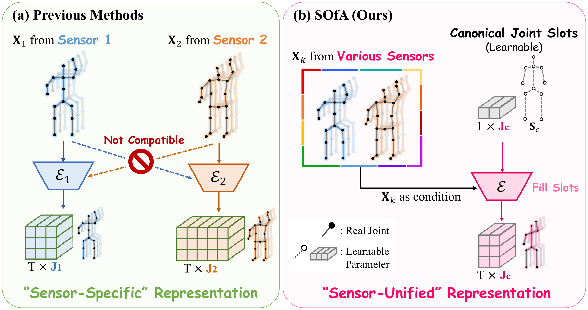
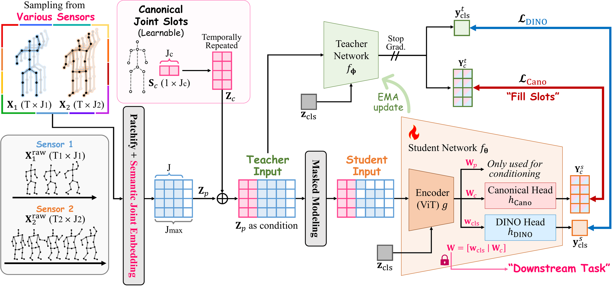
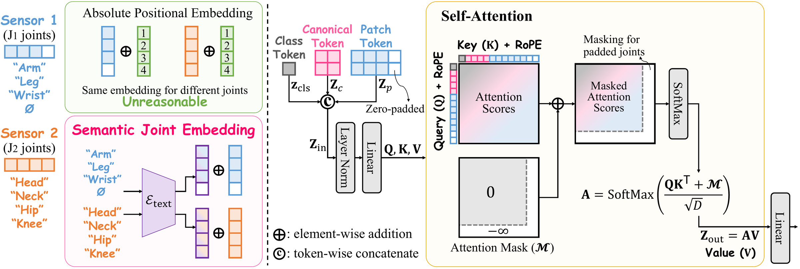
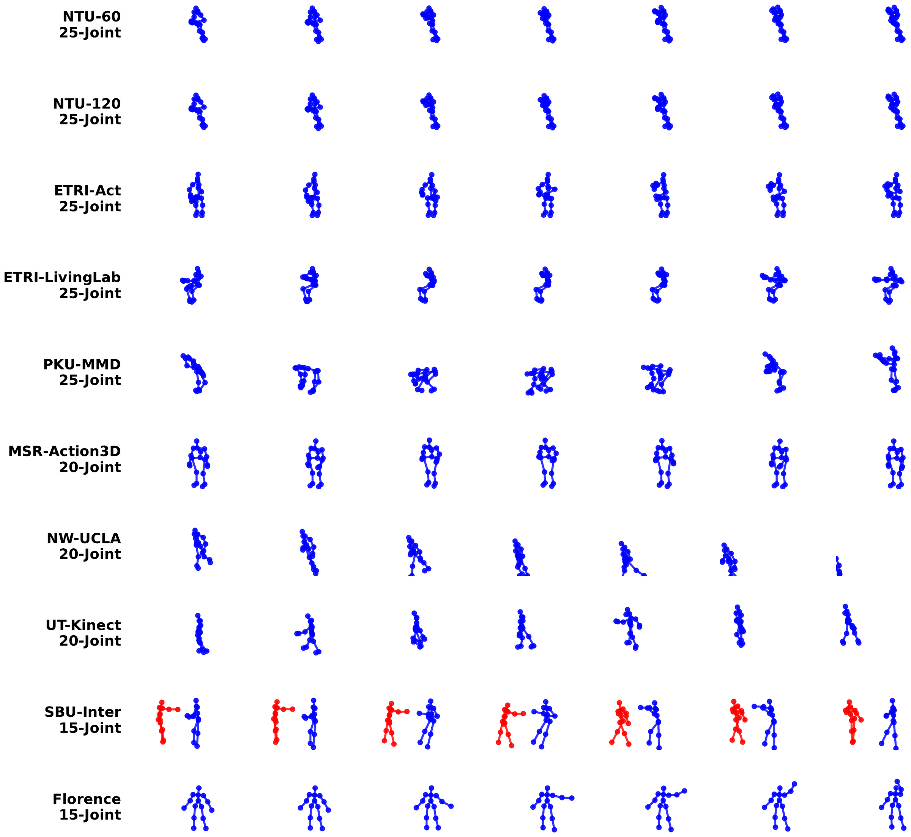
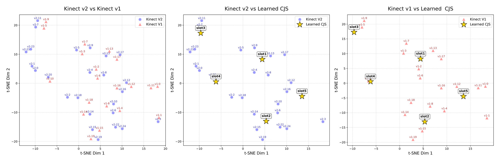

<div align="center">


<h2>One for All: Generalist Foundation Model for<br>Cross-Sensor Skeleton Representation Learning</h2>

<div>
    <a href='https://jeonghyeokdo.github.io/' target='_blank'>Jeonghyeok Do</a><sup>1</sup>&nbsp;&nbsp;&nbsp;&nbsp;
    <a href='https://therealchenyun.github.io/' target='_blank'>Yun Chen</a><sup>1</sup>&nbsp;&nbsp;&nbsp;&nbsp;
    <a href='https://www.viclab.kaist.ac.kr' target='_blank'>Munchurl Kim</a><sup>1&dagger;</sup>
</div>
<br>
<div>
    <sup>&dagger;</sup>Corresponding author
</div>
<div>
    <sup>1</sup>Korea Advanced Institute of Science and Technology, South Korea
</div>

<div>
    <h4 align="center">
        <a href="https://kaist-viclab.github.io/SOfA_site/" target='_blank'>
        
        </a>
        <a href="https://arxiv.org/abs/2609.07078" target='_blank'>
        
        </a>
        
        
    </h4>
</div>
</div>

---

> **Note** — Code and pre-trained weights will be released in this repository soon.
> The [project page](https://kaist-viclab.github.io/SOfA_site/) carries the full set of results
> in the meantime.

**SOfA (Skeleton One for All)** is the *first* **sensor-unified** generalist foundation model for skeleton
representation learning. A single encoder ingests skeletons from any 3D sensor — regardless of joint count,
indexing protocol, or topology — and emits one standardized representation.

* 🦴 **One encoder, any sensor.** 15 / 20 / 25 / 30-joint topologies through the *same weights*, with no
  per-dataset reconfiguration and no architectural change.
* 🎯 **Canonical Joint Slots (CJS).** A fixed-size set of learnable slots acts as a universal vessel; arbitrary
  sensor sequences enter only as a *condition* and dynamically fill the slots via masked self-attention.
* 🔤 **Semantic Joint Embedding (SJE).** Rigid absolute positional embeddings are replaced by text-encoder
  features built from joint *names*, so anatomically identical joints share a latent identity across sensors.
* ⚡ **6.59× cheaper inference.** 4.30 GFLOPs vs. 28.32 for MAE-based SSL baselines, while *improving* accuracy.
* 🌍 **Ten datasets, one coordinate frame.** Standardized into a shared hip-centered metric frame; eight are used for pre-training and the two 15-joint sets are held out as unseen.

---

## Motivation



**(a)** Previous methods couple the architecture to a fixed joint count and rigid absolute positional embeddings,
so each sensor needs an isolated encoder and the resulting features are mutually incompatible — a
*sensor-specific* representation. **(b)** SOfA introduces learnable **Canonical Joint Slots**; a single shared
encoder fills them from any sensor input to produce a *sensor-unified* representation.

---

## Overview of SOfA



SOfA is trained in a teacher–student distillation framework. The student sees a **90% masked** view and must
*fill* the canonical slots by inferring missing kinematics from sparse visible cues, matching the unmasked
teacher's slot representations (`L_Cano`) while aligning global semantics (`L_DINO`):

```
L_total = L_Cano + λ · L_DINO        (λ = 1.0)
```

After encoding, the sensor-specific patch tokens `W_p` are **discarded** — only the unified canonical
representation `W = [w_cls | W_c]` reaches downstream tasks.

---

## Canonical Joint Slots & Semantic Joint Embedding



| Structural barrier | Symptom | SOfA's answer |
| --- | --- | --- |
| **Joint index misalignment** | The same index means different anatomy across sensors — or a zero-padded slot | **SJE** — encode the joint *name* (`"A human skeleton joint of the {Left Wrist}"`) with a pre-trained T5 text encoder |
| **Joint count discrepancy** | Fixed topologies cannot batch 15-, 20- and 25-joint skeletons together | **CJS** — a fixed-size set of learnable slots filled by masked self-attention, with padded joints masked to −∞ |

---

## Method

* **Encoder** — ViT with 8 layers, `D = 256`, 8 heads (**SOfA-L**: 12 layers, `D = 384`, 12 heads), plus 4 register
  tokens.
* **Input** — `T = 64` frames, patch size `(P_T, P_J) = (8, 1)`, zero-padded to `J_max = 25`.
* **Slots** — `J_c = 5` canonical slots, replicated along the time axis; 1D temporal RoPE inside attention.
* **Heads** — two 3-layer MLPs (`h_Cano`, `h_DINO`), hidden 2,048 / bottleneck 256, `K = 65,536` prototypes.
* **Objectives** — canonical slot reconstruction + DINO distillation, with KoLeo regularization (weight 0.1) and
  Sinkhorn–Knopp prototype-assignment regularization.
* **Schedule** — 120 epochs, AdamW, base LR `2e-4`, 20-epoch warmup, cosine decay to `1e-6`, EMA momentum
  0.994 → 1, batch 1,536 across 8× NVIDIA RTX A6000.
* **Augmentation & masking** — rotation, scaling, spatial flip, axis dropout (`p = 0.5` each); joint-wise masking
  as augmentation (`p = 0.5`) and a **90% masking ratio** for the canonical reconstruction objective.

---

## Datasets

Ten heterogeneous 3D skeleton datasets, standardized into a shared hip-centered coordinate frame with the
vertical body axis aligned to *y* and coordinates in meters.

| Dataset | Tracker | Joints | Classes | Samples | Setting |
| --- | :---: | :---: | :---: | ---: | --- |
| NTU-60 | Kinect v2 | 25 | 60 | 56,880 | Pre-train & Downstream |
| NTU-120 | Kinect v2 | 25 | 120 | 114,480 | Pre-train & Downstream |
| PKU-MMD | Kinect v2 | 25 | 51 | 7,096 | Pre-train & Downstream |
| ETRI-Act | Kinect v2 | 25 | 55 | 112,620 | Pre-train & Downstream |
| ETRI-LivingLab | Kinect v2 | 25 | 55 | 8,605 | Pre-train & Downstream |
| MSR-Action3D | Kinect v1 | 20 | 20 | 567 | Pre-train & Downstream |
| NW-UCLA | Kinect v1 | 20 | 10 | 1,494 | Pre-train & Downstream |
| UT-Kinect | Kinect v1 | 20 | 10 | 199 | Pre-train & Downstream |
| SBU-Inter | Custom Tracker 1 | 15 | 8 | 282 | **Unseen (OOD)** |
| Florence | Custom Tracker 2 | 15 | 9 | 215 | **Unseen (OOD)** |



The two 15-joint protocols are reserved **exclusively** for unseen evaluation — they follow different joint
layouts and indexing systems, so transfer is non-trivial rather than a simple dimensionality reduction.

---

## Results

### Linear evaluation — 25-joint benchmarks

Top-1 accuracy (%), joint modality only, no multi-stream ensemble. Baselines train **one model per dataset**;
SOfA uses a **single unified representation** across all of them.

| Method | Publication | NTU-60 X-Sub | NTU-60 X-View | NTU-120 X-Sub | NTU-120 X-Set | PKU-MMD X-Sub |
| --- | :---: | :---: | :---: | :---: | :---: | :---: |
| *Sensor-Specific Representation* | | | | | | |
| GL-Transformer | ECCV'22 | 76.3 | 83.8 | 66.0 | 68.7 | – |
| CPM | ECCV'22 | 78.7 | 84.9 | 68.7 | 69.6 | 48.3 |
| CMD | ECCV'22 | 79.8 | 86.9 | 70.3 | 71.5 | 43.0 |
| AimCLR | AAAI'22 | 74.3 | 79.7 | 63.4 | 63.4 | – |
| HYSP | ICLR'23 | 78.2 | 82.6 | 61.8 | 64.6 | – |
| HaLP | CVPR'23 | 79.7 | 86.8 | 71.1 | 72.2 | 43.5 |
| ActCLR | CVPR'23 | 80.9 | 86.7 | 69.0 | 70.5 | – |
| RVTCLR | ICCV'23 | 74.7 | 79.1 | – | – | – |
| SkeletonMAE | ICMEW'23 | 74.8 | 77.7 | 72.5 | 73.5 | 36.1 |
| MAMP | ICCV'23 | 84.9 | 89.1 | 78.6 | 79.1 | 53.8 |
| PTSL | AAAI'23 | 77.3 | 81.8 | 66.2 | 67.7 | 49.3 |
| S-JEPA | ECCV'24 | 85.3 | 89.8 | 79.6 | 79.9 | 53.5 |
| IGM | ECCV'24 | 86.2 | 91.2 | <ins>80.0</ins> | 81.4 | – |
| MacDiff | ECCV'24 | 86.4 | 91.0 | 79.4 | 80.2 | – |
| HSP | CVPR'25 | 80.7 | 88.0 | 71.0 | 73.2 | 48.9 |
| USDRL | AAAI'25 | 85.2 | 91.7 | 76.6 | 78.1 | 54.4 |
| GFP | ICCV'25 | 85.9 | 92.0 | 79.1 | 80.3 | 56.2 |
| AMR | CVPR'26 | **87.4** | <ins>92.3</ins> | **81.1** | <ins>81.9</ins> | 60.3 |
| *Sensor-Unified Representation* | | | | | | |
| **SOfA (Ours)** | – | 85.7 | 92.1\* | 79.2 | 80.4 | <ins>65.4</ins> |
| **SOfA-L (Ours)** | – | <ins>87.0</ins> | **92.6**\* | 79.5 | **82.0** | **67.1** |

**Bold** = best, <ins>underline</ins> = second best. \* X-View<sup>\*</sup> is the leakage-free subset
(see [Evaluation protocol](#evaluation-protocol)).

On **PKU-MMD**, SOfA-L beats the previous best specialist (AMR, 60.3%) by **+6.8%-point**. Data-rich benchmarks
let specialists saturate by overfitting to sample volume; the smaller PKU-MMD limits isolated models, and SOfA
closes the gap by transferring skeletal priors learned across the whole corpus.

### Seen benchmarks with other joint counts

| ETRI-Act (25-joint) | Top-1 | | NW-UCLA (20-joint) | Top-1 |
| --- | :---: | --- | --- | :---: |
| *Fully-supervised* | | | *Sensor-Specific* | |
| IndRNN | 73.9 | | LongT-GAN | 74.3 |
| Beyond Joint | 79.1 | | P&C | 84.9 |
| SK-CNN | 83.6 | | MCAE-MP | 84.9 |
| ST-GCN | 86.8 | | SeBiReNet | 80.3 |
| Ensem-NN | 83.0 | | Colorization | 91.1 |
| MANs | 82.4 | | GL-Transformer | 90.4 |
| HCN | 88.0 | | Masked-Color | 92.0 |
| FSA-CNN | 90.6 | | | |
| **SOfA (un-supervised)** | 87.9 | | **SOfA (sensor-unified)** | **92.9** |

NW-UCLA is reached with **the exact same weights** as the 25-joint results above.

### Generalization to unseen 15-joint sensors

Both datasets are **completely excluded from pre-training**. Frozen encoder, no fine-tuning.

| Florence (15-joint) | Top-1 | | SBU-Inter (15-joint) | Top-1 |
| --- | :---: | --- | --- | :---: |
| *Seen + Fully-supervised* | | | *Seen + Fully-supervised* | |
| Seidenari *et al.* | 82.0 | | Co-LSTM | 90.4 |
| Devanne *et al.* | 87.0 | | ST-LSTM | 93.3 |
| Vemulapalli *et al.* | 90.9 | | VA-LSTM | 97.2 |
| HarSkel | 94.4 | | GCA | 94.9 |
| | | | LSTM-IRN | 98.2 |
| | | | IGFormer | 98.4 |
| | | | ISTA-Net | 98.5 |
| *Unseen + Sensor-Specific* | | | *Unseen + Sensor-Specific* | |
| SkeletonMAE | 66.8 | | SkeletonMAE | 73.1 |
| MAMP | 73.7 | | MAMP | 80.2 |
| *Unseen + Sensor-Unified* | | | *Unseen + Sensor-Unified* | |
| **SOfA (Ours)** | 91.7 | | **SOfA (Ours)** | 97.0 |

Sensor-specific SSL methods collapse on out-of-distribution topologies (66.8% / 73.1%); SOfA lands in the range
of fully-supervised models trained end-to-end on these datasets with full label access.

### Less cost, more accuracy

| Method | Tokens `T × J` | Train GFLOPs | Inference GFLOPs | PKU-MMD X-Sub |
| --- | :---: | :---: | :---: | :---: |
| *Sensor-Specific* | | | | |
| SkeletonMAE | 30 × 25 | 19.67 | 28.32 | 36.1 |
| MAMP | 30 × 25 | 19.67 | 28.32 | 53.8 |
| S-JEPA | 30 × 25 | 47.99 | 28.32 | 53.5 |
| GFP | 30 × 25 | 4.18 | 28.32 | 56.2 |
| *Sensor-Unified* | | | | |
| **SOfA** | 8 × (25+5) | 8.60 | **4.30** | 65.4 |
| **SOfA-L** | 8 × (25+5) | 14.90 | 7.45 | **67.1** |

### Other downstream tasks

| Semi-supervised, NTU-60, 1% labels | X-Sub | X-View | | Action retrieval, NTU-60 | X-Sub | X-View |
| --- | :---: | :---: | --- | --- | :---: | :---: |
| MAMP | 66.0 | 68.7 | | HiCo | 68.3 | 84.8 |
| S-JEPA | 67.5 | 69.1 | | MAMP | 62.0 | 70.0 |
| GFP | **71.8** | <ins>72.9</ins> | | GFP | <ins>70.9</ins> | **87.1** |
| **SOfA** | <ins>71.6</ins> | **74.2**\* | | **SOfA** | **72.1** | <ins>86.8</ins>\* |

| MSR-Action3D (20-joint) | Top-1 | | UT-Kinect (20-joint) | Top-1 |
| --- | :---: | --- | --- | :---: |
| HON4D *(supervised)* | 82.2 | | Xia *et al.* *(supervised)* | 90.9 |
| Rahmani *et al.* *(supervised)* | 82.7 | | Devanne *et al.* *(supervised)* | 91.5 |
| Tran *et al.* *(supervised)* | 84.5 | | Wang *et al.* *(supervised)* | 96.5 |
| **SOfA** *(un-supervised)* | 82.2 | | **SOfA** *(un-supervised)* | **97.0** |

### Ablations

| CJS | SJE | NTU-60 | NTU-120 | PKU-MMD | NW-UCLA | UT-Kinect |
| :---: | :---: | :---: | :---: | :---: | :---: | :---: |
| ✗ | ✗ | 75.2 | 70.7 | 50.9 | 68.9 | 77.0 |
| ✓ | ✗ | 84.9 | 78.7 | 64.7 | 72.3 | 80.0 |
| ✗ | ✓ | 76.4 | 71.4 | 52.3 | 86.7 | 91.0 |
| **✓** | **✓** | **85.7** | **79.2** | **65.4** | **92.9** | **97.0** |

Removing **CJS** costs 8.48% on average — without it, every sensor protocol is squeezed through a single class
token. Removing **SJE** collapses NW-UCLA from 92.9% to 72.3%: roughly 90% of the corpus is 25-joint Kinect-v2
data, so without a semantic anchor the network biases toward that indexing.

| Slots `J_c` | NTU-60 | NTU-120 | PKU-MMD | NW-UCLA | UT-Kinect | Inference GFLOPs |
| :---: | :---: | :---: | :---: | :---: | :---: | :---: |
| 0 | 76.4 | 71.4 | 52.3 | 86.7 | 91.0 | 3.60 |
| **5** | **85.7** | **79.2** | **65.4** | **92.9** | 97.0 | 4.30 |
| 10 | 85.5 | 79.0 | 64.5 | 92.7 | **98.0** | 5.41 |
| 15 | 85.3 | 78.9 | 63.5 | 91.8 | 97.0 | 6.55 |



The five slots autonomously converge toward the semantic centers of distinct anatomical clusters — the torso and
the four limbs. If CJS were a generic compression bottleneck its optimal size would be arbitrary; instead
performance peaks at exactly five, matching the five major regions of the human body.

### Scalability and extended topology

| Method | NTU-60 X-Sub | NTU-60 X-View | NTU-120 X-Sub | NTU-120 X-Set | PKU-MMD X-Sub |
| --- | :---: | :---: | :---: | :---: | :---: |
| SOfA | 85.7 | 92.1\* | 79.2 | 80.4 | 65.4 |
| SOfA (`J = 30`) | 85.5 | 91.9\* | 79.0 | 80.1 | 65.6 |
| **SOfA-L** | **87.0** | **92.6**\* | **79.5** | **82.0** | **67.1** |

Zero-padding to `J_max = 25` is a batching convenience, **not an architectural ceiling**. The `J = 30` row runs an
extended synthetic topology built by interpolating joint pairs and describing them to SJE in text
(`"midpoint of J_a and J_b"`) — performance holds *without retraining*.

---

## Evaluation protocol

SOfA pre-trains one encoder on a combined corpus, so NTU-60 / NTU-120 need care: NTU-120 contains every NTU-60
sequence.

* **Pre-training corpus** — NTU-120 only, keeping just the sequences assigned to training by **both** protocols
  (X-Sub ∩ X-Set): **25,053 sequences, 22% of NTU-120**.
* **Directly usable test sets** — NTU-120 X-Sub, NTU-120 X-Set, NTU-60 X-Sub (NTU-60 and NTU-120 share the same
  X-Sub assignment for the original 40 subjects).
* **NTU-60 X-View\*** — X-View splits by camera ID while X-Set splits by setup ID, so some official X-View test
  sequences land in the pre-training corpus. We remove all **5,392** overlapping sequences by sequence ID,
  leaving **13,568** sequences reported as **X-View\***. Filtering happens before evaluation and does not depend
  on model predictions.

---

## Code release

Code and pre-trained weights are **not yet public**. This repository will be populated with:

- [ ] Pre-training code and configs for the unified ten-dataset corpus
- [ ] Unified preprocessing scripts for all ten datasets
- [ ] Linear / semi-supervised / retrieval evaluation
- [ ] SOfA and SOfA-L pre-trained encoder weights

⭐ Star or watch this repository to be notified when it lands.

---

## News

- **Sep 2026:** Project page released

---

## Reference

```BibTeX
@article{do2026sofa,
  title={One for All: Generalist Foundation Model for Cross-Sensor Skeleton Representation Learning},
  author={Do, Jeonghyeok and Chen, Yun and Kim, Munchurl},
  journal={arXiv preprint arXiv:2609.07078},
  year={2026}
}
```

Our prior work on skeleton representation learning, [SLiM](https://github.com/KAIST-VICLab/SLiM) ([project page](https://kaist-viclab.github.io/SLiM_site/)):

```BibTeX
@inproceedings{do2026less,
  title={Less is More: Compact-Token Masked Feature Prediction for Skeleton Representation Learning},
  author={Do, Jeonghyeok and Chen, Yun and Youk, Geunhyuk and Kim, Munchurl},
  booktitle={Advances in Neural Information Processing Systems (NeurIPS)},
  year={2026}
}
```

## Acknowledgements

This work builds on ideas from [DINOv2](https://github.com/facebookresearch/dinov2),
[MM-DiT](https://arxiv.org/abs/2403.03206) and [T5](https://github.com/google-research/text-to-text-transfer-transformer).
We thank the authors of the ten public skeleton datasets that make a unified corpus possible.

---
